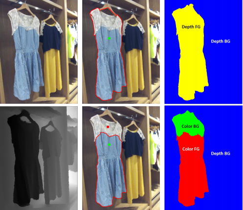
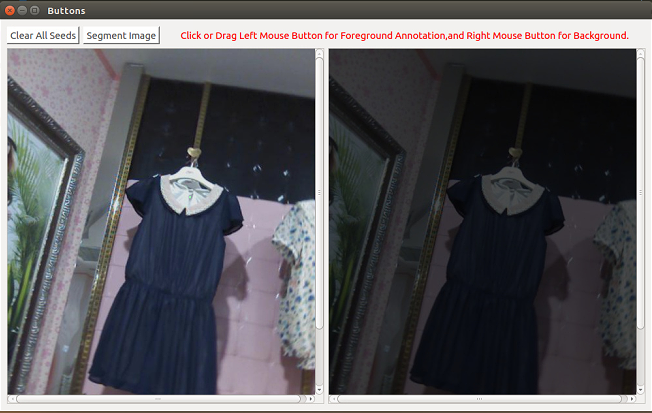
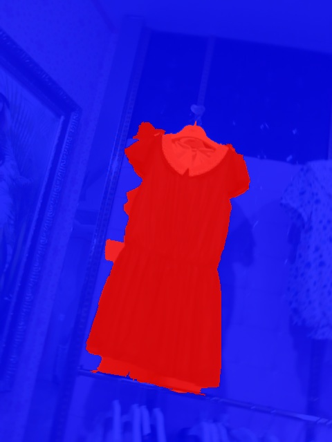

# Interactive-Segmentation-on-RGBD-Images-via-Cue-Selection
Python implementation of paper "Interactive Segmentation on RGBD Images via Cue Selection".



### Dependencies
```
Python3.x (Tested with 3.5)
opencv
PyQt5
scikit-learn
PyMaxflow
Dijkstar
```

### Installation
To use this code, please do:

0. Clone the repo:
    ```Shell
    git clone https://github.com/jfzhang95/Chinese_Poem_Writer
    cd Chinese_Poem_Writer
    ```

1. To try the demo, please run:
    ```Shell
    python main.py
    ```

If installed correctly, the GUI should look like this:
<p align="center"></p>

You can add some foreground and background seeds in image, and then click ``Segment Image``. After a few seconds,
the result should look like this:
<p align="center"></p>

Each color's label is presented as follow:


For more details about this algorithm, please see in [paper](http://openaccess.thecvf.com/content_cvpr_2016/papers/Feng_Interactive_Segmentation_on_CVPR_2016_paper.pdf) and [code](https://github.com/ZVsion/rgbd_image_segmentation/blob/master/GraphMaker.py).

